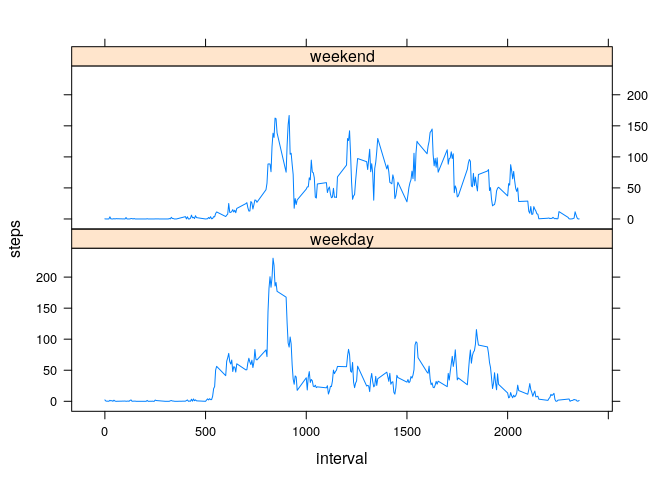

Loading and preprocessing the data
==================================

This is my R Markdown document for assignment for week 2 in reproducible
research. The following codes below reads the csv file and finds total
steps per day.

    library(readr)
    activity <- read_csv("activity.csv")
    activity_steps_day <- aggregate(steps ~ date, data = activity, sum, na.rm = TRUE)

What is mean total number of steps taken per day?
-------------------------------------------------

The following lines of codes are used to generate a histogram plot and
also outputs mean and median for the number of steps taken \#\#\# Make a
histogram of the total number of steps taken each day

    hist(activity_steps_day$steps)

    me <- mean(activity_steps_day$steps)
    md <- median(activity_steps_day$steps)

### Calculate and report the mean and median total number of steps taken per day

The mean number of steps per day is 1.076618910^{4} and median number of
steps is 1.076510^{4}

What is the average daily activity pattern?
-------------------------------------------

First we have to make data with interval pattern. The following line
performs this and plots the timeseries data \#\#\# Make a time series
plot (i.e. type = “l”) of the 5-minute interval (x-axis) and the average
number of steps taken, averaged across all days (y-axis)

    activity_interval <- aggregate(steps ~ interval, data = activity, mean, na.rm = TRUE)
    plot(steps~interval, activity_interval, type ="l")

\#\#\# Which 5-minute interval, on average across all the days in the
dataset, contains the maximum number of steps?

We can use the following r code to find the maximum step interval

    ma <- activity_interval[which.max(activity_interval$steps),]$interval

The interval with maximum step is 835.

Imputing missing values
-----------------------

### Calculate and report the total number of missing values in the dataset (i.e. the total number of rows with NAs)

The following line of code computes number of missing values

    mi_va <- sum(is.na(activity$steps))

The number of missing values is 2304

### Devise a strategy for filling in all of the missing values in the dataset. The strategy does not need to be sophisticated. For example, you could use the mean/median for that day, or the mean for that 5-minute interval, etc.

### Create a new dataset that is equal to the original dataset but with the missing data filled in.

Here I am going to use mean steps of 5-minute interval to fill in NAs. A
new variable activity\_new is created

    activity_new <- activity
    for (var in 1:dim(activity)[1]) {
      if (is.na(activity[var,]$steps)) {
        activity_new[var,]$steps <- activity_interval[activity_interval$interval==activity[var,]$interval,]$steps
      }
    }

### Make a histogram of the total number of steps taken each day and Calculate and report the mean and median total number of steps taken per day. Do these values differ from the estimates from the first part of the assignment? What is the impact of imputing missing data on the estimates of the total daily number of steps?

The new histogram is shown below

    activity_new_steps_day <- aggregate(steps ~ date, data = activity_new, sum)
    hist(activity_steps_day$steps)

    me_nw <- mean(activity_new_steps_day$steps)
    md_nw <- median(activity_new_steps_day$steps)

The new mean number of steps per day is 1.076618910^{4} and median
number of steps is 1.076618910^{4}. The mean remains same while median
is changed little bit.

Are there differences in activity patterns between weekdays and weekends?
-------------------------------------------------------------------------

### Create a new factor variable in the dataset with two levels – “weekday” and “weekend” indicating whether a given date is a weekday or weekend day.

The code below adds the weekday and weekend to activiyt\_new

    activity_new$day <- weekdays(as.Date(activity_new$date))
    activity_new[!grepl('^S',activity_new$day),]$day <- "weekday"
    activity_new[grepl('^S',activity_new$day),]$day <- "weekend"
    activity_new_steps_day = aggregate(steps ~ interval + day, activity_new, mean)

### Make a panel plot containing a time series plot (i.e. type = “l”) of the 5-minute interval (x-axis) and the average number of steps taken, averaged across all weekday days or weekend days (y-axis).

The plot below shows the timeseries for weekdays and weekends

    library(lattice)
    xyplot(steps ~ interval | factor(day), data = activity_new_steps_day, type = "l", layout = c(1,2))

